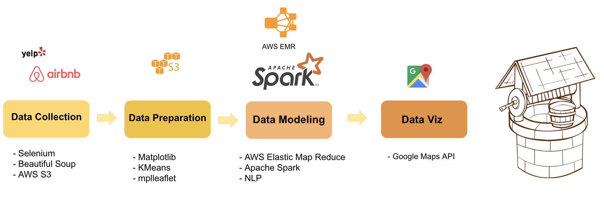
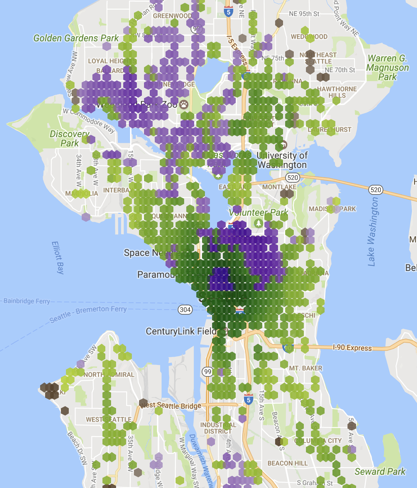

# WanderWell

The WanderWell is intended to be a resource for a user to identify neighborhoods within a city which contain destinations which are of interest to the user.  The application’s primary intent is for a tourist interested in seeing areas of a city which embody the nature of the city, but are not necessarily featured on brochures.  The user will be able to select the types of activities of interest to them; which will be coffee, nightlife, available lodging, and dining in the first iteration, and will later be expanded to select specific types of cuisines.  While the tool is primarily intended for visitors to a new city, it may also serve as a tool for current residents of a locale to rediscover their city.

Data, in the form of general locale interest, user reviews and photos, has been retrieved from pubically avaliable sources.  Seattle will serve as the original locality for the test.  Since the intent of the tool is to help the user visit a city in a way more typical of a local, lodging information is made available through the AirBnB api.  Which contains cost, reviews, locations, and room information for at home lodging options in the area.  Additionally, if the user is interested in the nightlife experience, information is extracted using the HERE API, which contains  traffic flow telemetry extracted from navigation embedded in the cars of several German automobile manufactures.

Information from AirBNB can be extracted through an API, and will not require any complex scraping operations.  HERE uses an interface which requests the user to submit a JSON query containing the location where traffic data is requested.  AirBnB contains an API interface which allows the user to request the nearest available lodging by submitting a longitude and latitude to the API. 

For each given category, points of interest will be given a score relative to similar locations.  The score will be based on neighborhood density, composite distance of lodging, number of reviews, average review rating, biased for the average rating provided by the reviewer as well as the number of reviews provided by the reviewer, frequency of reviews/images over the past 6 months, and quality of images posted by users.  Once each restaurant is given a score, the coordinates of the city will be separated into a grid, and each point along that grid will be rated by the composite score (corrected for distance) of all points of interest within an established distance.  That distance, and the associated distance correction, will be adjusted so that areas of increased density are not unfairly overrepresented.

Once the model development process has been developed.  The model will be submitted for review by locals.  As Seattle is the first destination, there should be no shortage of locals with opinions on hidden gem desirability.  When the model has been developed programmatically, it will be deployed to Portland and compared with pre-established knowledge on that city.

The deployment of the WanderWell is a website.  The website contains four available inputs by the user.  The user will be allowed to select their travel priorities, and how important they are to the user.  By changing the relative importance of Coffee, Nightlife, or Resturaunts, the user can make their own adjustments to the recommendation engine.  The final output observed by the user will be a heatmap of the city which contains the top 4-5 most highly scored points of interest in 2-3 neighborhoods deemed desirable to the user by the model.
Later iterations may utilize a search field where the user may identify the precise interests most relevant to them, but identifying the cross-comparison of categories is not an initial goal of this project.  Additionally, as more data is collected, the tool may grow to include several other cities, and the suburbs of major cities.

